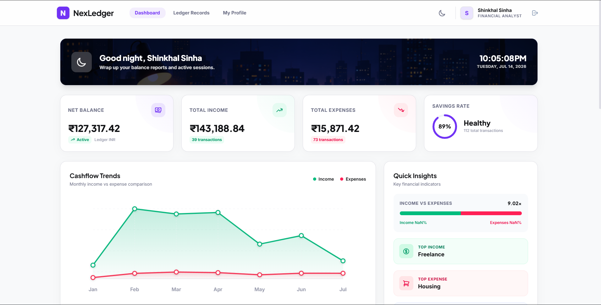
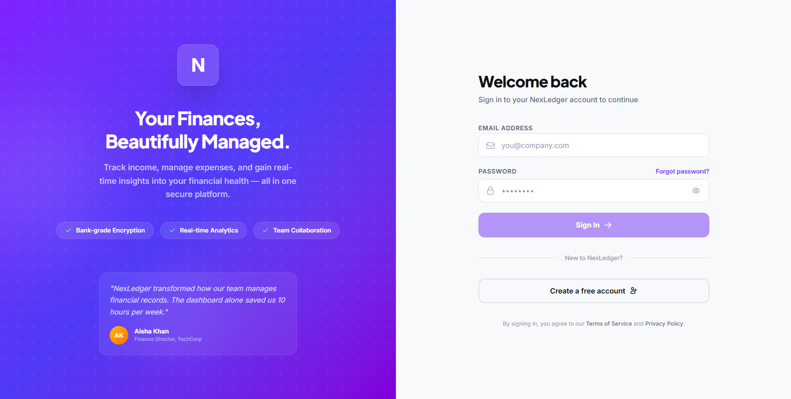
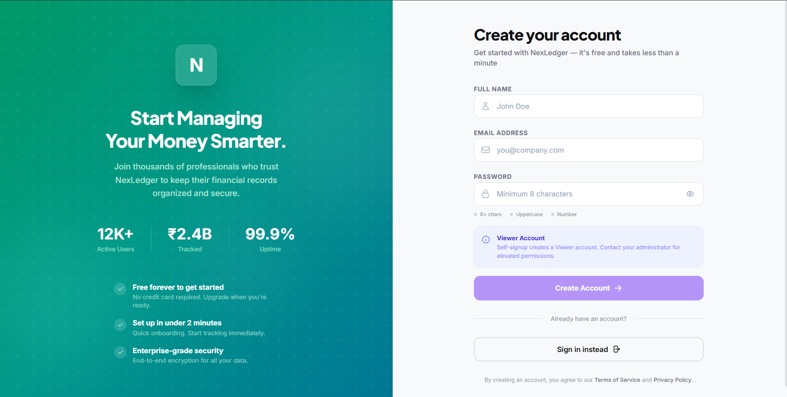
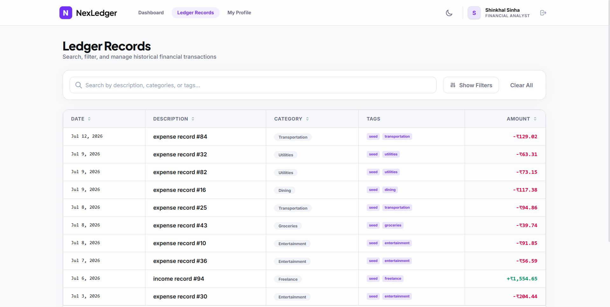
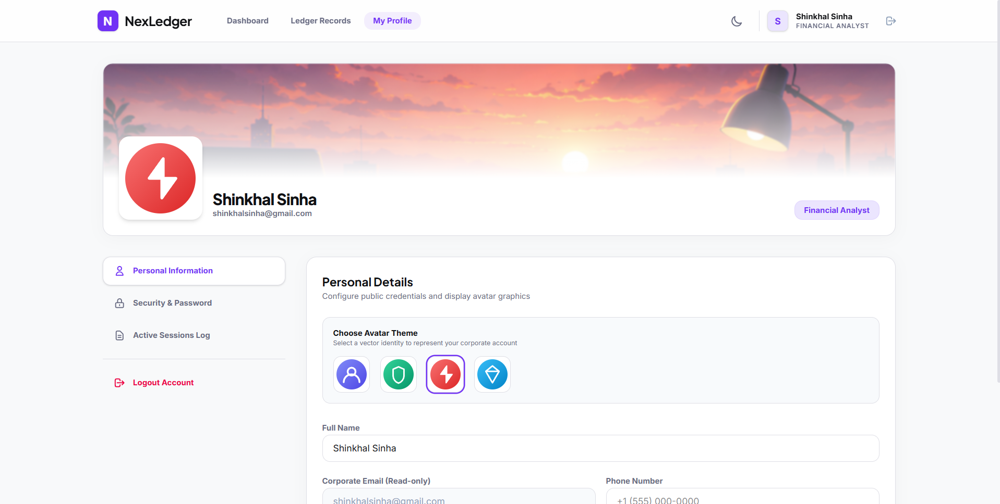

# NexLedger

**NexLedger** is a production-style financial management platform built with Angular, Express.js, MongoDB, and Bun. It enables organizations to securely manage income and expenses, monitor financial analytics, enforce role-based access control, and maintain comprehensive audit trails. The project demonstrates modern full-stack engineering practices, scalable architecture, and AI-assisted software development.

---

## 🔗 Live Demo

- **Frontend Web Application:** [https://nex-ledger-mu.vercel.app](https://nex-ledger-mu.vercel.app)
- **Backend API Service:** [https://nexledger-x09a.onrender.com/api](https://nexledger-x09a.onrender.com/api)

---

## 📸 Screenshots

Here is a preview of the NexLedger application interfaces:

### 📊 Dashboard


### 🔑 Authentication (Login & Sign Up)
<p align="center">
  
  
</p>

### 📁 Financial Records


### 👤 User Profile & Role Info



---

## 🚀 Tech Stack

### Frontend

- **Framework:** Angular (v19)
- **Styling:** Tailwind CSS (Modern, utility-first)
- **Build Tool:** Angular CLI / Webpack
- **Features:** Responsive design, Dark mode, Dynamic SVG charting, Reactive forms.

### Backend

- **Runtime:** Bun
- **Framework:** Express.js
- **Database:** MongoDB (via Mongoose)
- **Authentication:** JWT (JSON Web Tokens)
- **Email Services:** Resend API

---

## ✨ Key Features

- **Dashboard Analytics:** A comprehensive command center with animated stats, expense/income dual breakdowns, savings rate donut charts, and gradient-filled trend lines.
- **Financial Records Management:** Add, edit, and categorize income and expenses with detailed tagging.
- **Role-Based Access Control (RBAC):** Distinct roles (`VIEWER`, `ANALYST`, `ADMIN`) with secure route guarding and API middleware.
- **System Audit Trails:** Automatic tracking of all user actions (creation, updates, deletions) for administrative review.
- **Modern Authentication:** Split-pane login and registration flows, password recovery, and secure session management.
- **Dark/Light Mode:** First-class dark mode support across the entire application.

---

## 🏗️ System Architecture

The application uses a clean decoupled structure with a clear boundary between client and server:

```text
Angular 19 (Client)
       ↓
   Express API
       ↓
Business Services
       ↓
    MongoDB
       ↓
  Audit Logs
```

---

## 📐 Engineering Decisions

- **Feature-based Angular Architecture:** Organizes components, services, and routing by feature (e.g., Auth, Dashboard, Records) rather than component type, ensuring scalability as the codebase grows.
- **Separation of Concerns:** Clear partitioning on the backend between Controllers (routing/validation), Services (business logic), and Models (data persistence).
- **JWT Authentication:** Implemented stateless access/refresh token rotation stored securely, avoiding stateful session storage.
- **Soft Deletion:** Primary financial records use a soft-deletion strategy to preserve ledger audit trail integrity.
- **Runtime Validation:** Leverages Zod on the backend for request validation and type safety before hitting controllers.
- **RBAC Middleware:** Centralized middleware handles role-based authorization rules securely across various endpoints.
- **Tailwind CSS:** Utilized to accelerate UI development and maintain styling consistency.
- **Bun Runtime:** Used on the backend to improve startup and compilation speed, along with package management efficiency.

---

## 🤖 AI Tools & Usage

Evaluating developer productivity and AI utilization is an integral part of this assignment. Below is the documentation of how AI tools were integrated into the development workflow.

### AI Tools Used

- **ChatGPT** (Architectural design and conceptual modeling)
- **GitHub Copilot** (Inline code completion and boilerplate generation)
- **Google Gemini** (System orchestration, debugging, and comprehensive documentation review)

### How AI Helped

AI was used throughout development to accelerate productivity while maintaining full ownership of the implementation. Specifically, AI assisted with:

- Brainstorming application architecture and folder structures.
- Generating initial boilerplate for Angular components and Express routes.
- Debugging Angular dependency injection issues, route guards, and interceptors.
- Designing Mongoose schemas and defining indices for audit logs.
- Improving API request validation rules using Zod.
- Reviewing, refactoring, and linting code for professional readability.
- Structuring and writing high-quality developer documentation.

_Note: Every AI-generated suggestion was reviewed, modified, tested, and integrated manually to ensure safety, robustness, and style compliance._

---

## 🧑‍💻 What I Implemented Myself

While AI was used to accelerate development tasks, the entire core system design and implementation were handled manually:

- **Overall Application Architecture:** Designed the monorepo structure and integration boundaries.
- **Angular App Structure:** Created the core/shared/features layout and implemented lazy loading.
- **Authentication Flow:** Built the frontend route guards, backend token validation, and credentials hashing.
- **RBAC Implementation:** Designed and coded the backend permission middleware and frontend role-based view directives.
- **Express API & MongoDB Schema Design:** Wrote schemas, indexes, and controllers manually.
- **Audit Logging System:** Built the Mongoose hooks and service layer that record CRUD actions seamlessly.
- **Financial Dashboard & Analytics:** Coded custom SVG charts and data transformation utility functions.
- **Error Handling & Validation:** Structured error handler middleware and frontend reactive form validation.

---

## ⚠️ Challenges Faced

- **Scalable Angular Directory Design:** Navigating features vs. shared organization, ensuring no circular dependencies between lazy-loaded modules.
- **Stateful Audit Trails with Soft Delete:** Coordinating soft deletes with audit logs to ensure accurate history while keeping financial balances correctly synchronized.
- **Robust Role-Based Authorization:** Implementing synchronized RBAC checks across both the client-side Angular router and backend Express routes to prevent API bypasses.
- **Reusable Chart Components:** Coding dynamic SVG charts from scratch in Angular without heavy external libraries to keep the bundle size small and load times fast.

---

## 🔮 Future Improvements

- **Multi-Tenant Organizations:** Support for isolated workspaces for different organizations or teams.
- **Bank API Integration:** Connect to Plaid or similar services to sync real bank transactions.
- **Real-Time Notifications:** Integrate WebSockets or Server-Sent Events (SSE) for audit trail alerts.
- **Exports:** Support for exporting ledger records to PDF reports and CSV spreadsheets.
- **Testing Expansion:** Comprehensive Unit and Integration testing suite for critical financial calculators.
- **Dockerization:** Containerizing the frontend and backend for cloud-native deployment.
- **CI/CD Pipeline:** GitHub Actions for automated linting, typechecking, and deployment to Render/Vercel.

---

## 📂 Project Structure

This is a monorepo containing both the frontend and backend applications:

```text
NexLedger/
├── backend/            # Express.js API server
│   ├── src/
│   │   ├── controllers/  # Route logic
│   │   ├── models/       # Mongoose schemas
│   │   ├── routes/       # API endpoints
│   │   ├── services/     # Business logic
│   │   └── validations/  # Request validation
│   └── ...
├── docs/               # Documentation assets
│   └── screenshots/    # Application screenshots
└── frontend/           # Angular Web App
    ├── src/
    │   ├── app/
    │   │   ├── core/     # Services, models, guards, interceptors
    │   │   ├── features/ # Lazy-loaded feature modules (Auth, Dashboard, etc.)
    │   │   └── shared/   # Reusable components (Modals, Toasts, Layouts)
    │   └── ...
```

---

## 🛠️ Getting Started

### Prerequisites

Ensure you have the following installed on your machine:

- [Bun](https://bun.sh/) (for the backend)
- [Node.js](https://nodejs.org/) & [npm](https://www.npmjs.com/) (for the frontend)
- [MongoDB](https://www.mongodb.com/) (Local or Atlas URI)

### Installation

1. **Clone the repository:**

   ```bash
   git clone https://github.com/Shinkhal/NexLedger.git
   cd NexLedger
   ```

2. **Setup the Backend:**

   ```bash
   cd backend
   bun install
   ```

   Create a `.env` file in the `backend` directory (refer to `.env.example` if available) and add your `MONGO_URI`, `JWT_SECRET`, and `RESEND_API_KEY`.

3. **Setup the Frontend:**
   ```bash
   cd ../frontend
   npm install
   ```

### Running the Application

**Run the Backend (Development Mode):**

```bash
cd backend
bun dev
```

_The backend API will start on `http://localhost:5000` (configured in `.env`)._

**Run the Frontend (Development Mode):**

```bash
cd frontend
npm start
```

_The Angular app will start on `http://localhost:4200`._

---

## 🔒 Security & Best Practices

- Passwords are cryptographically hashed using `bcryptjs`.
- All routes demanding analytical or destructive actions are protected by rigorous RBAC middleware.
- Soft-deletion strategy implemented across primary financial records to maintain audit integrity.
- Form inputs are validated and sanitized on both the frontend (Angular Reactive Forms) and backend (Zod validations).

---

## 📝 License

This project is licensed under the MIT License.
